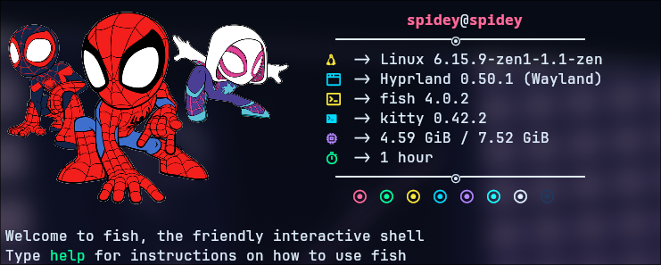
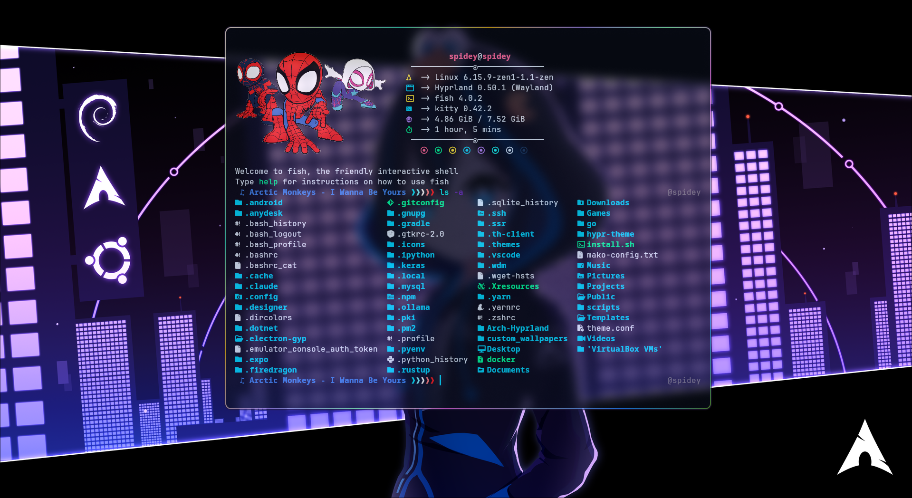
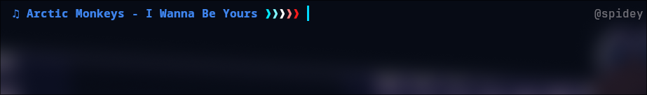

# 🌊 My Linux Configs 🌊

Welcome to the **My** **Linux Configs** repository! This collection of configurations is designed to give your Linux environment a sleek, cyan-inspired aesthetic. ✨

## ⚠️ Important: Backup Your Original Configurations ⚠️

Before applying these configurations, make sure to back up your existing configuration files. This ensures you can revert to your original setup if needed.

## 🛠️ Backup Commands for Specific Configurations

To back up specific configurations, use the following commands:

### Fish Shell

```bash
cp -r ~/.config/fish ~/.config/fish_backup
```

### Fastfetch

```bash
cp -r ~/.config/fastfetch ~/.config/fastfetch_backup
```

## 📂 How to Use

1. **Backup your original configs** (as mentioned above).
2. Copy the contents of this repository to your `~/.config` directory:
   ```bash
   cp -r /path/to/this/repo/* ~/.config
   ```
3. Customize the configurations to suit your preferences.

## 🖼️ Previews

Here are some previews of the configurations included in this repository:

### Fastfetch



### Fish Shell



### Fish Shell Song Name



## ✍️ Customization

Feel free to tweak the configurations to match your personal style. Each configuration file is well-documented to help you make changes easily.

## 💙 Credits

- **Fastfetch**: A blazing-fast system information tool.
- **Fish Shell**: The friendly interactive shell.

Enjoy your new cyan-themed Linux setup! 🌟
